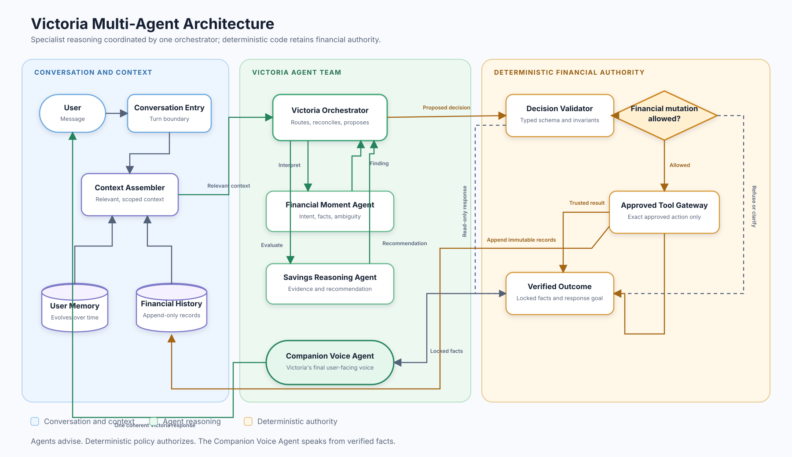
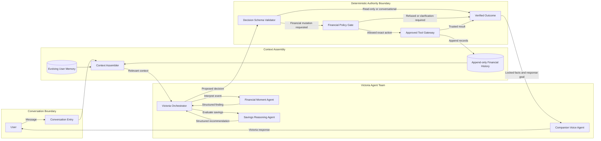

# Victoria Agentic Architecture

Status: Proposed

This diagram captures the proposed supervisor-style multi-agent architecture for Victoria. A central orchestrator coordinates bounded specialists, while deterministic application code retains authority over financial state.

## Mermaid Source

## Boundary Meanings

### Victoria Orchestrator

The orchestrator owns turn-level coordination. It selects the necessary specialist, combines structured findings, and proposes the next action. It does not directly create or modify financial records.

### Financial Moment Agent

This specialist interprets the reported event. It may identify the event type, merchant, candidate amount, amount provenance, ambiguity, and missing information. Its output is evidence, not permission to mutate state.

### Savings Reasoning Agent

This specialist evaluates whether the evidence supports a savings suggestion. It may recommend an amount and explain whether the amount is user-provided or estimated. It cannot create, approve, or record a proposal.

### Companion Voice Agent

This specialist is Victoria's dedicated conversational voice. It receives verified facts and a permitted response goal, then produces supportive, practical, nonjudgmental wording. It cannot change amounts, approval state, tool results, or required disclosures.

The Companion Voice Agent is a behavioral companion, not a licensed therapist. It must not diagnose users, claim clinical authority, or encourage emotional dependence.

### Deterministic Authority Boundary

Typed validation, financial policy, tools, cents arithmetic, proposal lifecycle rules, approval binding, idempotency, and ledger writes live outside probabilistic agent reasoning. Model output crossing this boundary is untrusted until validated.

### Memory And History

User memory may evolve as Victoria learns habits and preferences. Financial events, suggestions, proposals, approvals, declines, ledger entries, and corrections form append-only history. New understanding may affect future decisions but must not rewrite earlier records.

## Turn-Level Flow

1. Assemble the current message, conversation state, relevant user memory, and immutable financial history.
2. Let the orchestrator select only the specialists needed for this turn.
3. Require specialists to return schema-validated findings rather than free-form commands.
4. Let the orchestrator propose one next action.
5. Validate the action and apply deterministic financial policy.
6. Execute an allowed tool only when the exact approval and stored proposal permit it.
7. Pass locked facts and the response goal to the Companion Voice Agent.
8. Return one coherent Victoria response and append any resulting records.

## Open Diagram Questions

- Whether emotional posture should be a separate structured pass from final response composition inside the Companion Voice Agent.
- Whether habit analysis becomes a dedicated agent or remains deterministic memory retrieval during the MVP.
- Which read-only specialist calls can run concurrently without making conversational behavior harder to audit.
