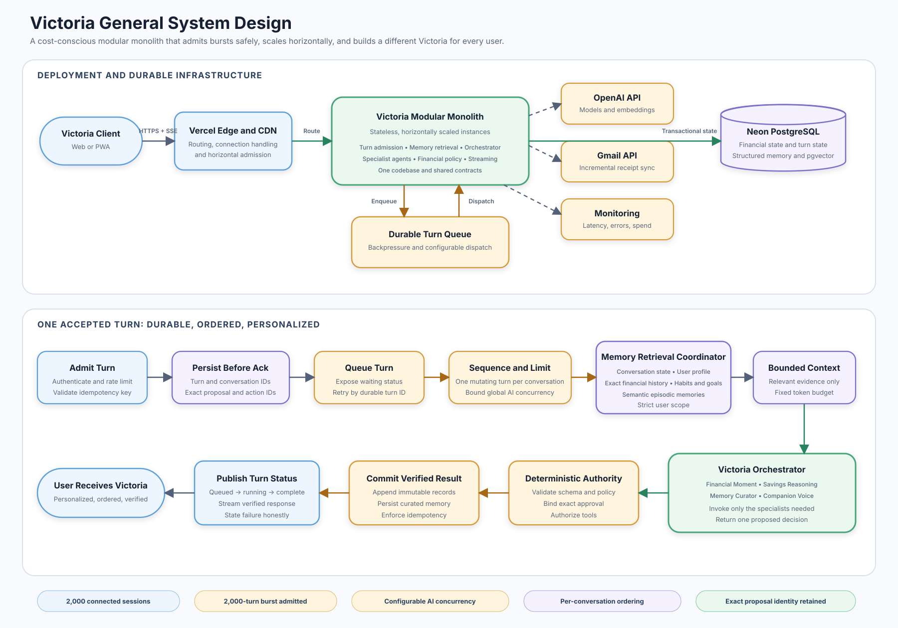
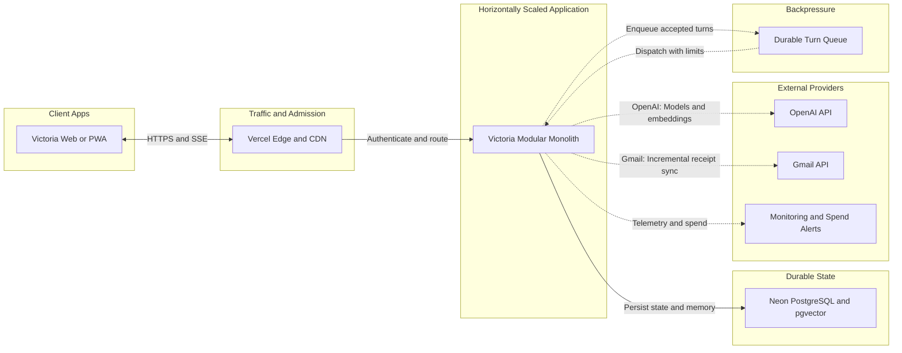

# Victoria General System Design

Status: Proposed

Victoria is designed as one stateless, modular application that can scale horizontally. It accepts turns durably before executing them, limits concurrent AI work, preserves ordering within each conversation, and assembles a user-specific memory package for every turn.

## Capacity Contract

1. Maintain 2,000 connected sessions.
2. Accept a burst of 2,000 turn submissions without losing or duplicating one.
3. Execute a configurable number of AI turns concurrently.
4. Queue excess turns briefly and expose their status.
5. Preserve per-conversation ordering.
6. Retain the exact stored proposal identity for any queued approval-sensitive action.

Accepting 2,000 turns does not mean starting 2,000 multi-agent executions at once. Durable admission and bounded execution protect provider limits, database capacity, and cost while keeping every accepted turn recoverable.

## Deployment Recommendation

Use Vercel Fluid Compute for the Next.js application and Neon PostgreSQL with pgvector for durable state and semantic memory.

This is the recommended current balance rather than a permanent platform commitment:

- It matches Victoria's existing Next.js and TypeScript stack.
- Horizontally scaled, I/O-heavy request handling is managed by the platform.
- PostgreSQL keeps financial records, conversation state, structured memory, semantic memory, and idempotency in one transactional system.
- The modular boundaries and provider adapters keep migration to containers, Cloudflare, or a larger cloud possible later.

Cloudflare Workers may have lower raw request cost, but it adds runtime adaptation and operational complexity now. A container platform offers more runtime control but introduces idle cost and scaling work. AWS or GCP provide a higher eventual ceiling at substantially greater solo-development overhead.

## High-Level Mermaid Source

## Inside The Modular Monolith

The application remains one codebase and one product boundary, with internal modules for:

- Authentication, tenant isolation, and per-user rate limits.
- Turn admission, idempotency, and status.
- Per-conversation sequencing and configurable concurrency.
- Memory retrieval and bounded context assembly.
- Victoria orchestration and specialist-agent handoffs.
- Deterministic financial policy and approved tools.
- Streaming verified outcomes to the user.
- Asynchronous memory curation and incremental receipt ingestion.

These are code modules, not independently deployed microservices. Worker entry points may scale separately while sharing the same application artifact, contracts, and database.

## Personalized Context Flow

For each executable turn, the Memory Retrieval Coordinator builds a bounded context package from:

- Current conversation state.
- Structured user profile and companion preferences.
- Exact financial history.
- Semantic episodic memories stored with pgvector.
- Relevant habits, goals, and recent derived order facts.

The Victoria Orchestrator routes that package only to necessary specialists:

- Financial Moment Agent.
- Savings Reasoning Agent.
- Memory Curator Agent when lasting knowledge may have changed.
- Companion Voice Agent for final user-facing wording.

The Memory Curator proposes sourced, confidence-scored memories. Deterministic validation controls persistence. Exact amounts, approvals, totals, proposal state, and ledger records always come from structured data rather than semantic retrieval.

## Turn Admission And Execution

1. Authenticate the user and authorize the conversation.
2. Validate or create a client idempotency key.
3. Persist the turn before acknowledging acceptance.
4. Preserve any proposal and approval identifiers with the queued turn.
5. Enqueue the durable turn identifier.
6. Acquire the per-conversation execution slot.
7. Respect the global and per-user AI concurrency budgets.
8. Retrieve memory and execute the orchestrator.
9. Commit verified records and the response atomically where practical.
10. Publish status and stream or return the verified response.

Retries reconstruct committed results by turn and action identifiers. They must not create duplicate approvals, memories, proposals, or ledger entries.

## Cost Controls

- Invoke only specialists required for the current turn.
- Use deterministic code for approval, arithmetic, ledger totals, and common routing.
- Run Memory Curator work asynchronously and selectively.
- Embed curated summaries and derived order facts, not entire inboxes.
- Use one bounded context package rather than sending full history to every agent.
- Apply per-user, per-turn, and monthly provider budgets.
- Add Redis or a dedicated vector database only after measurements justify another service.

## Reassessment Triggers

Reconsider Vercel, Neon, or the single-deployment shape when measured evidence shows one of the following:

- Sustained platform compute cost exceeds an equivalent managed-container design after operational cost is included.
- Provider burst or duration limits materially degrade turn latency.
- Queue workers need independent release or scaling cycles.
- PostgreSQL vector workload interferes with transactional financial workloads.
- Compliance, regional processing, or availability requirements exceed the selected plans.
